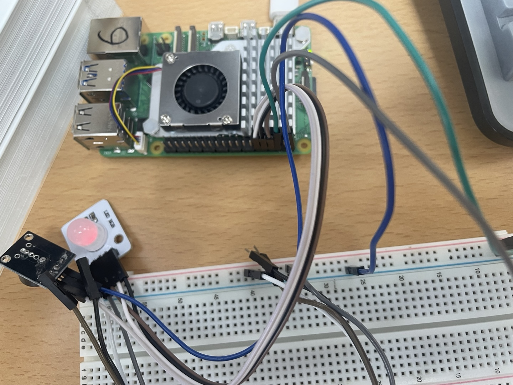

# ESP32-study
ESP32 개인 스터디 리포지토리

## Day01(2025-07-15)

### ESP32를 다루기위한 기초 세팅
1. 아두이노 IDE 설치
    - [아두이노](https://www.arduino.cc/en/software/)

2. ESP32 보드 매니저 설치
    - 아두이노 IDE를 실행
    - 파일 -> 환경설정(기초설정)
    - 추가적인 보드 매니저 URL(Additional Boards Manager URLs) 칸에 아래 URL추가
        - https://raw.githubusercontent.com/espressif/arduino-esp32/gh-pages/package_esp32_index.json
    - 툴 -> 보드 -> 보드매니저
        - ESP32 검색 후 esp32 by Espressif Systems 설치

3. 드라이버 설치 및 확인
    - 대부분의 ESP32 모듈은 USB-Serial 변환 칩으로 CP210x 또는 CH340G를 사용
    - CP210x 드라이버 사용
        - [CP210x](https://www.silabs.com/developer-tools/usb-to-uart-bridge-vcp-drivers)
    - 드라이버가 제대로 설치되었는지 확인하는 방법은 ESP32를 컴퓨터에 연결한 후, 장치 관리자(Device Manager)에서 `포트`에서 확인
    - 

4. 아두이노 IDE에서 보드 및 포트 설정
    - 아두이노 IDE에서 툴(Tools) > 보드(Board) > ESP32 Arduino 메뉴 아래에서 사용하는 ESP32 보드 종류를 선택
    - 툴(Tools) > 포트(Port)에서 ESP32가 연결된 COM 포트를 선택

5. 예제 코드 업로드 및 실행 (`블링크` 예제)
    - 파일(File) > 예제(Examples) > 01.Basics > Blink를 클릭하여 블링크 예제 코드를 오픈
    - ESP32 내장 LED가 깜빡이는 간단한 코드
    - 아두이노 IDE 상단의 업로드(Upload) 버튼 (오른쪽 화살표 모양)을 클릭하여 코드를 ESP32에 업로드
    - 스케치 컴파일 후 업로드
    - 

    - [LED](./Day01/ESP_LED/ESP_LED.ino)

6. 두번째 예제 RGB_LED_FADE
    - [RGB_LED_FADE](./Day01/ESP_RGB_led/ESP_RGB_led.ino)

https://github.com/user-attachments/assets/72f9896c-f79b-4198-9239-8e1f2d20859f

## Day02(2025-07-23)

### 라즈베리파이 텔레그램 봇 알림 시스템 프로젝트

#### 1. 프로젝트 개요
이 프로젝트는 라즈베리파이를 사용하여 텔레그램 봇으로부터 메시지를 수신하고, 특정 메시지("긴급")에 따라 빨강/파랑 LED 깜빡임과 사이렌 소리를 내며, 그 외 모든 메시지에 대해 초록색 LED와 일반 부저음을 내는 시스템입니다. Flask 웹 프레임워크와 RPi.GPIO 라이브러리를 사용하며, Ngrok을 통해 라즈베리파이의 로컬 서버를 외부(텔레그램)에 노출합니다.

#### 2. 준비물
* 라즈베리파이 (Raspberry Pi 3B+ 또는 4 권장) 및 전원 어댑터
* Micro SD 카드 (운영체제 설치용, 16GB 이상 권장)
* 인터넷 연결 (Wi-Fi 또는 이더넷 케이블)
* 빵판 (브레드보드)
* 점퍼 와이어
* RGB LED (공통 캐소드 또는 공통 애노드 타입 확인 필수)
* 패시브 부저
* PC (PuTTY 또는 다른 SSH 클라이언트, 웹 브라우저)

#### 3. 라즈베리파이 초기 설정
1.  **Raspberry Pi OS 설치:** Raspberry Pi Imager를 사용하여 Micro SD 카드에 Raspberry Pi OS Lite (GUI 없는 버전)를 설치합니다. SSH 활성화를 잊지 마세요.
2.  **SSH 접속:** PC에서 PuTTY(또는 터미널)를 사용하여 라즈베리파이에 SSH로 접속합니다.
    (예: `ssh pi@<라즈베리파이IP주소>`)
3.  **시스템 업데이트:**
    ```bash
    sudo apt update
    sudo apt upgrade -y
    ```
4.  **필요 라이브러리 설치:**
    ```bash
    sudo apt install python3-pip -y
    pip install flask
    ```
    (RPi.GPIO는 보통 기본 설치되어 있습니다.)
5.  **프로젝트 디렉토리 생성:**
    ```bash
    mkdir ~/PiSrc
    cd ~/PiSrc
    ```
6.  **가상 환경 설정 (권장):**
    ```bash
    sudo apt install python3-venv -y
    python3 -m venv env
    source env/bin/activate
    ```
    (이후 작업 시 항상 `source env/bin/activate`로 가상 환경 활성화)

#### 4. Ngrok 설정
1.  **Ngrok 다운로드:**
    PC 브라우저에서 `https://ngrok.com/download` 에 접속하여 회원가입 후 라즈베리파이에 맞는 ARM 버전 `ngrok`을 다운로드합니다. (라즈베리파이 터미널에서 `wget <다운로드 링크>`)
2.  **압축 해제 및 이동:**
    ```bash
    unzip ngrok-v3-stable-linux-arm64.zip # 또는 arm.zip
    mv ngrok ~ # 홈 디렉토리로 이동
    ```
3.  **인증 토큰 연결:** `ngrok.com` 계정의 `Your Authtoken` 페이지에서 제공하는 명령어를 라즈베리파이 터미널에서 실행합니다. (예: `ngrok config add-authtoken <YOUR_AUTH_TOKEN>`)

#### 5. 텔레그램 봇 설정
1.  **BotFather를 통해 봇 생성:**
    텔레그램 앱에서 `@BotFather`를 검색하여 봇을 생성합니다. `/newbot` 명령을 사용하여 봇 이름을 지정하고, 사용자 이름을 설정하면 **API Token**을 받게 됩니다. 이 토큰을 잘 보관하세요.
2.  **그룹 채팅 ID 확인 (선택 사항):**
    만약 그룹 채팅에서 알림을 받으려면, 봇을 그룹에 추가하고 `@RawDataBot`을 통해 그룹 채팅 ID를 확인합니다. (이 프로젝트에서는 1:1 채팅만 가정)

#### 6. 하드웨어 연결 (GPIO 핀 번호 BCM 기준)
**주의:** 라즈베리파이 전원을 끈 상태에서 작업하세요. LED에는 반드시 220~330옴 저항을 직렬로 연결하여 과전류를 방지하세요.

* **부저 (패시브):**
    * 부저 (+) 핀 → 라즈베리파이 **GPIO 17** 핀
    * 부저 (-) 핀 → 라즈베리파이 **GND** 핀
* **RGB LED (예시: 공통 캐소드 기준):**
    * RGB LED의 빨간색 핀 → 저항 → 라즈베리파이 **GPIO 27** 핀
    * RGB LED의 초록색 핀 → 저항 → 라즈베리파이 **GPIO 22** 핀
    * RGB LED의 파란색 핀 → 저항 → 라즈베리파이 **GPIO 23** 핀
    * RGB LED의 가장 긴 다리 (공통 캐소드) → 라즈베리파이 **GND** 핀



#### 7. 파이썬 코드 (`kakao.py`)
아래 코드를 `~/PiSrc/kakao.py` 파일로 저장합니다.

```python
import RPi.GPIO as GPIO
import time
from flask import Flask, request
import json

# --- GPIO 핀 설정 ---
# 실제 연결된 GPIO 핀 번호에 맞게 수정하세요.
# BCM 모드 (GPIOxx 번호)를 기준으로 합니다.
BUZZER_PIN = 17      # 부저 연결 핀
RED_LED_PIN = 27     # RGB LED 빨간색 핀
GREEN_LED_PIN = 22   # RGB LED 초록색 핀
BLUE_LED_PIN = 23    # RGB LED 파란색 핀

# GPIO 설정
GPIO.setmode(GPIO.BCM) # BCM 핀 번호 사용
GPIO.setup(BUZZER_PIN, GPIO.OUT)
GPIO.setup(RED_LED_PIN, GPIO.OUT)
GPIO.setup(GREEN_LED_PIN, GPIO.OUT)
GPIO.setup(BLUE_LED_PIN, GPIO.OUT)

# 초기 LED 상태: 모두 끄기 (코드 시작 시)
GPIO.output(RED_LED_PIN, GPIO.LOW)
GPIO.output(GREEN_LED_PIN, GPIO.LOW)
GPIO.output(BLUE_LED_PIN, GPIO.LOW)

# PWM 객체 생성 (부저 핀, 초기 주파수)
buzzer_pwm = GPIO.PWM(BUZZER_PIN, 1) # 초기 주파수는 1Hz (아무 값이나)

# --- 부저 및 LED 제어 함수 ---
def turn_off_all_leds():
    """모든 LED를 끄는 함수 (공통 캐소드 기준: LOW로 끄기)"""
    GPIO.output(RED_LED_PIN, GPIO.LOW)
    GPIO.output(GREEN_LED_PIN, GPIO.LOW)
    GPIO.output(BLUE_LED_PIN, GPIO.LOW)

def buzz_sound(duration=0.5, frequency=1000, volume_duty_cycle=50):
    """
    일반 부저음을 울리는 함수 (RPi.GPIO PWM 사용).
    duration: 소리가 나는 시간 (초)
    frequency: 소리의 주파수 (Hz).
    volume_duty_cycle: 소리의 크기 (0-100).
    """
    print(f"일반 알림 부저 울림: 주파수 {frequency}Hz, 듀티 사이클 {volume_duty_cycle}%, 지속 시간 {duration}초")
    buzzer_pwm.ChangeFrequency(frequency)
    buzzer_pwm.start(volume_duty_cycle)
    time.sleep(duration)
    buzzer_pwm.stop()

def play_siren_sound(repeat_count=3, low_freq=800, high_freq=1200, tone_duration=0.2, volume_duty_cycle=70):
    """
    삐뽀삐뽀 사이렌 소리를 내고, 빨강/파랑 LED를 번갈아 깜빡이는 함수 (RPi.GPIO PWM 사용).
    repeat_count: 삐뽀삐뽀 반복 횟수
    low_freq: 낮은 음의 주파수 (Hz)
    high_freq: 높은 음의 주파수 (Hz)
    tone_duration: 각 음이 지속되는 시간 (초)
    volume_duty_cycle: 소리의 크기 (0-100)
    """
    print(f"긴급 알림 사이렌 울림: {repeat_count}회 반복, 빨강/파랑 깜빡임")
    
    turn_off_all_leds() # 사이렌 시작 전 모든 LED 끄기

    buzzer_pwm.start(volume_duty_cycle) # PWM 시작
    
    for i in range(repeat_count):
        # 첫 번째 음 (보통 높은 음) + 빨간색 LED 켜기
        buzzer_pwm.ChangeFrequency(high_freq)
        GPIO.output(RED_LED_PIN, GPIO.HIGH)  # 빨간색 켜기
        GPIO.output(BLUE_LED_PIN, GPIO.LOW)  # 파란색 끄기
        time.sleep(tone_duration)

        # 두 번째 음 (보통 낮은 음) + 파란색 LED 켜기
        buzzer_pwm.ChangeFrequency(low_freq)
        GPIO.output(RED_LED_PIN, GPIO.LOW)   # 빨간색 끄기
        GPIO.output(BLUE_LED_PIN, GPIO.HIGH) # 파란색 켜기
        time.sleep(tone_duration)
        
    buzzer_pwm.stop() # 부저 중지
    
    turn_off_all_leds() # 사이렌 종료 후 모든 LED 끄기

# --- Flask 앱 설정 ---
app = Flask(__name__)

@app.route('/webhook', methods=['POST'])
def webhook():
    data = request.get_json()
    # 텔레그램으로부터 받은 전체 데이터 출력은 생략하고, 메시지 텍스트만 출력
    # print(f"텔레그램으로부터 받은 데이터: {json.dumps(data, indent=2)}")

    if 'message' in data:
        message = data['message']
        text = message.get('text', '')

        print(f"텔레그램으로부터 받은 메시지 텍스트: '{text}'") # 메시지 텍스트만 출력

        if "긴급" in text:
            print("긴급 알림 감지! 사이렌 재생 및 빨강/파랑 LED 깜빡임")
            play_siren_sound(repeat_count=3, low_freq=800, high_freq=1200, tone_duration=0.2, volume_duty_cycle=70)

        else: # '긴급'이 포함되지 않은 모든 다른 메시지에 대해
            print("일반 알림 감지! (긴급 외 모든 메시지) 부저 울림 및 LED 초록색")
            turn_off_all_leds() # 모든 LED 끄고 시작
            GPIO.output(GREEN_LED_PIN, GPIO.HIGH) # 초록색 LED 켜기
            buzz_sound(duration=0.5, frequency=1000, volume_duty_cycle=50)
            GPIO.output(GREEN_LED_PIN, GPIO.LOW) # 부저음 끝난 후 초록색 LED 끄기

    return "OK"

# --- 메인 실행 블록 ---
if __name__ == '__main__':
    try:
        print("Flask 서버 시작 중 (RPi.GPIO 사용)...")
        app.run(host='0.0.0.0', port=5000, debug=False) # debug=False 중요!
    except KeyboardInterrupt:
        print("서버 종료 중...")
    finally:
        print("GPIO 정리 중...")
        GPIO.cleanup() # GPIO 핀 정리 필수
        print("GPIO 정리 완료.")
```
#### 영상자료

https://github.com/user-attachments/assets/baeccef3-cdae-4dd2-8d53-d1dde83c96f0


https://github.com/user-attachments/assets/542e7bcb-b1cf-4b72-aebe-078485331153

