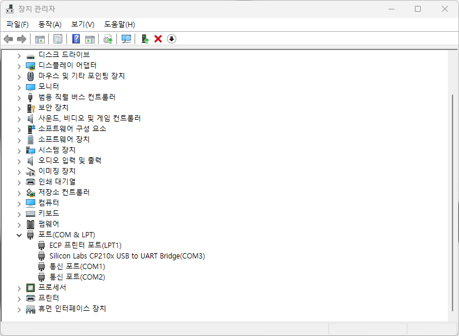
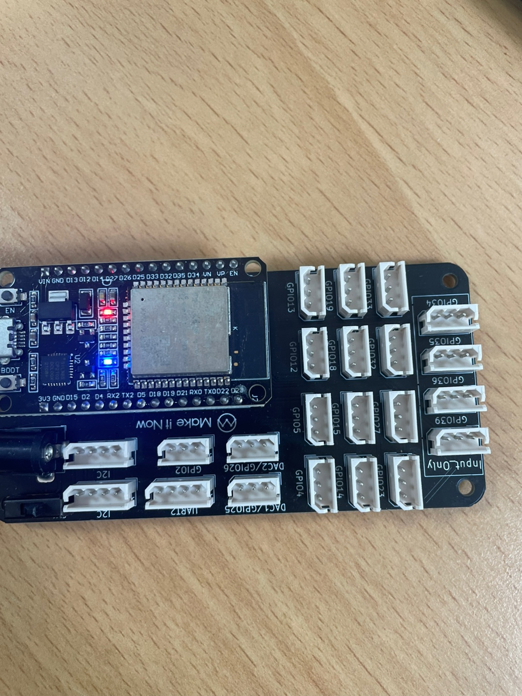

# ESP32-study
ESP32 개인 스터디 리포지토리

## Day01(2025-07-15)

### ESP32를 다루기위한 기초 세팅
1. 아두이노 IDE 설치
    - [아두이노](https://www.arduino.cc/en/software/)

2. ESP32 보드 매니저 설치
    - 아두이노 IDE를 실행
    - 파일 -> 환경설정(기초설정)
    - 추가적인 보드 매니저 URL(Additional Boards Manager URLs) 칸에 아래 URL추가
        - https://raw.githubusercontent.com/espressif/arduino-esp32/gh-pages/package_esp32_index.json
    - 툴 -> 보드 -> 보드매니저
        - ESP32 검색 후 esp32 by Espressif Systems 설치

3. 드라이버 설치 및 확인
    - 대부분의 ESP32 모듈은 USB-Serial 변환 칩으로 CP210x 또는 CH340G를 사용
    - CP210x 드라이버 사용
        - [CP210x](https://www.silabs.com/developer-tools/usb-to-uart-bridge-vcp-drivers)
    - 드라이버가 제대로 설치되었는지 확인하는 방법은 ESP32를 컴퓨터에 연결한 후, 장치 관리자(Device Manager)에서 `포트`에서 확인
    - 

4. 아두이노 IDE에서 보드 및 포트 설정
    - 아두이노 IDE에서 툴(Tools) > 보드(Board) > ESP32 Arduino 메뉴 아래에서 사용하는 ESP32 보드 종류를 선택
    - 툴(Tools) > 포트(Port)에서 ESP32가 연결된 COM 포트를 선택

5. 예제 코드 업로드 및 실행 (블링크 예제)
    - 파일(File) > 예제(Examples) > 01.Basics > Blink를 클릭하여 블링크 예제 코드를 오픈
    - ESP32 내장 LED가 깜빡이는 간단한 코드
    - 아두이노 IDE 상단의 업로드(Upload) 버튼 (오른쪽 화살표 모양)을 클릭하여 코드를 ESP32에 업로드
    - 스케치 컴파일 후 업로드
    - 

    - [LED](./Day01/ESP_LED/ESP_LED.ino)

6. 두번째 예제 RGB_LED_FADE
    - [RGB_LED_FADE](./Day01/ESP_RGB_led/ESP_RGB_led.ino)
